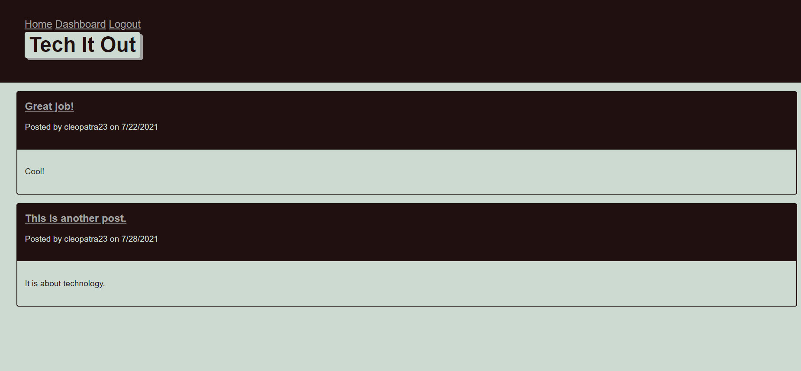

# Model-View-Controller (MVC): Tech Blog

## Description

This project is a node.js application that users can take advantage of in order to write quality README files. This project uses inquirer to populate input from the user,and create a new README.

 ## Table of Contents
 - [Description](#description)
 - [Installation](#installation)
 - [Usage](#usage)
 - [Contributing](#contributing)
 - [Contributing](#contributing)

## Installation

1. npm i - to install all file in order for npm to work
2. npm init - to create a json file
3. npm install express sequelize mysql2
4. npm install express-handlebars
5. npm install dotenv
6. npm install bcrypt 
6. npm install express-session 
7. npm install connect-session-sequelize

Be sure to establish your own .env file!

## Usage

If using locally:

Start application by typing npm start into the command-line/terminal. 
Visit: http://localhost:3001/

Live Deployment: [View Application](https://tranquil-scrubland-09008.herokuapp.com/)

## Screenshot and Video

## Contributing 

During the creation of this application, the following resources were consulted:

*[Handlebars Tutorial](https://www.youtube.com/watch?v=1srD3Mdvf50&t=1s)
*[priaravi23's GitHub](https://github.com/priyaravi23/mvc-tech-blog)

## Technology Used

1. Express.js is a minimal and flexible Node.js web application framework that provides a robust set of features for web and mobile applications.
2. Sequelize is a Promise-based Node.js ORM for Postgres, MySQL, MariaDB, SQLite and Microsoft SQL Server. It features solid transaction support, relations, eager and lazy loading, read replication and more.
3. MySQL is relational database management system based on SQL – Structured Query Language, used in this application to warehouse retail data.
4. Node.js is used for package managment and to execute JavaScript code to build command line tool for server-side scripting.
5. Handlebars provides the power necessary to let you build semantic templates effectively with no frustration.
6. bcrypt is a library to help you has passwords.
7. express-session and connect-session-sequelize are npm packages that help manage and store sessions using Sequelize. 

## Contributing

Reuben Genkin and Marykate Smith both contributed to the successful of this application.   